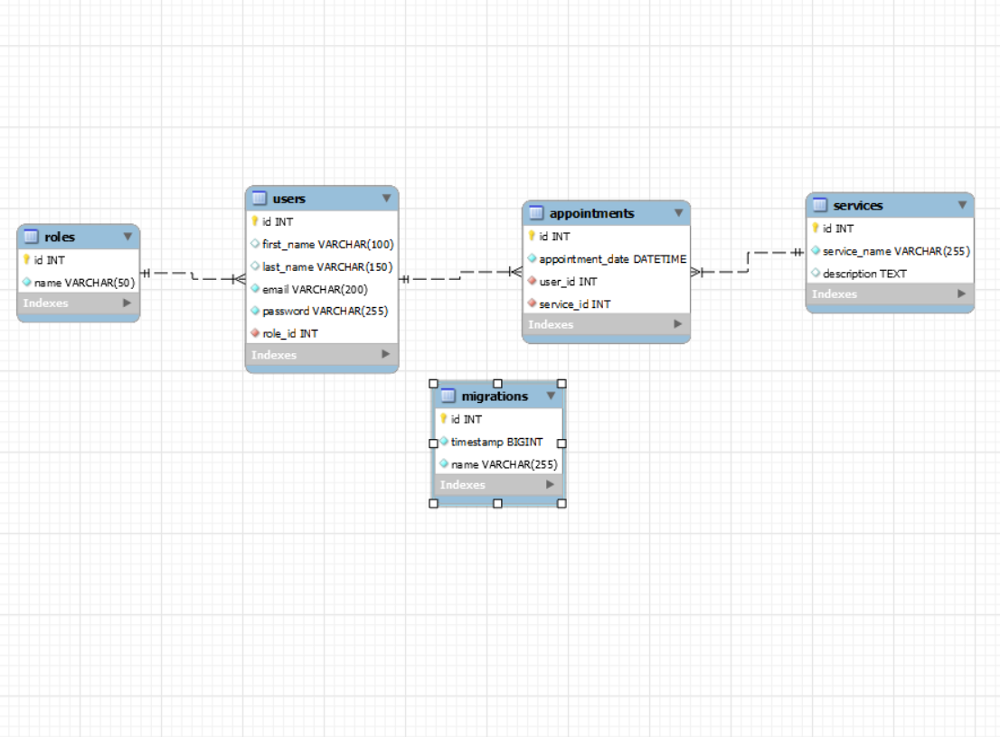

# Welcome to Tattoo Studio 🎨

 ## Table of Contents 🗂️
<details>
  <summary></summary>
  <ol>
    <li><a href="#about-the-project">About the project 📋</a></li>
    <li><a href="#getting-started">Getting started 🚀</a></li>
    <li><a href="#deploy">Deploy 🌐</a></li>
    <li><a href="#stack">Stack ⚓</a></li>
    <li><a href="#diagrama-bd">DB Diagram 📈</a></li>
    <li><a href="#endpoints">Endpoints 📌</a></li>
    <li><a href="#futuras-funcionalidades">Future features ⚙️</a></li>
    <li><a href="#contribuciones">Suggestions and contributions ❓</a></li>
    <li><a href="#licencia">License 🔑</a></li>
    <li><a href="#author">Author ✍️</a></li>
    <li><a href="#acknowledgments">Acknowledgments 🎓</a></li>
  </ol>
</details>

<div id="about-the-project"></div>

## About the project 📋
This is a Backend made for a fictitious tattoo Studio. This app contains users, appointments for the clients, a list of services of which you can choose and roles for the users. This project already conteins data but you can to fill with your own information.

<div id="getting-started"></div>

## Getting Started (Local) 	🚀
1. Download this respository zip or use git clone repository.
2. Use the next command to install all the apps dependencies: ` $ npm install `
3. Go to the env.example and change all variables to your database variables.
4. You can also change the port and the secret to encryct your passwords.
5. To start the server use `npm run start` and to stop it use control c in the terminal.
6. And finally to run the migrations and seeders use: `npm run dbRefresh` 

<div id="deploy"></div>  

## Deploy (Online)🌐
<div align="center">
    <a href="https://fra1.clusters.zeabur.com"><strong>Online URl of the server</strong></a>🚀🚀🚀 
</div>
<div align="center">
 (Deployed in a free service it may not work when you see this.)
</div>

<div id="stack"></div> 

## Stack ⚓
Tecnologies used:
<div align="center">
<a href=" https://www.mysql.com/">
    
</a>
<a href="https://www.expressjs.com/">
    
</a>
<a href="https://nodejs.org/es/">
    
</a>
<a href="https://www.typescriptlang.org/">
    
</a>
 </div>

<div id="diagrama-bd"></div>

## DB Diagram 	📈


<div id="endpoints"></div>

## Endpoints 📌
There is an export with all the endpoints in Thunderclient in the folder HTTP. In case you use another tecnology, all the endspoints are down here.
<details>
<summary>Endpoints</summary>

- AUTH
    - REGISTER

            POST http://localhost:4005/api/auth/register
        body:
        ``` js
            {
                "firstName":"Sarah",
                "lastName":"Miller",
                "email": "sarahmiller@sarahmiller.com",
                "password": "123456789"
            }
        ```

    - LOGIN

            POST http://localhost:4005/api/auth/login  
        body:
        ``` js
            {
                "email": "william@william.com",
                "password": "123456789"
            }
        ```
- SERVICES

    - GET ALL SERVICES

            GET http://localhost:4005/api/services

    - CREATE SERVICE (super_admin)

            POST http://localhost:4005/api/services
        body:
        ``` js
            {
                "serviceName":"body tattoo",
                "description":"duck in colored ink"
            }
        ```

    - UPDATE SERVICE (super_admin)

            PUT http://localhost:4005/api/services/4
        body:
        ``` js
            {
                "serviceName":"Head tattoo"
            }
        ```

    - DELETE SERVICE (super_admin)

            DELETE http://localhost:4005/api/services/3

- USERS

    - GET ALL USERS WITH PAGINATION OR SEARCH WITH EMAIL (super_admin)

            GET http://localhost:4005/api/users(Optional)?limit=6&page=2 or ?email=william@william.com

    - GET USER PROFILE (user)

            GET http://localhost:4005/api/users/profile

    - UPDATE USER PROFILE (user)

            PUT http://localhost:4005/api/users/profile
        body:
        ``` js
            {
                "firstName":"Adam"
            }
        ```

    - DELETE User (super_admin)

            DELETE http://localhost:4005/api/users/15

    - UPDATE USER ROLE (super_admin)

            PUT http://localhost:4005/api/users/12/role
        body:
        ``` js
            {
                "roleId":2
            }
        ```

- APPOINTMENTS

    - GET PROFILE APPOINTMENTS (user)

            GET http://localhost:4005/api/appointments

    - CREATE APPOINTMENT (user)

            POST http://localhost:4005/api/appointments
        body:
        ``` js
            {
                "appointmentDate":"2024-07-30 20:10:00",
                "serviceId":2
            }
        ```
    - GET PROFILE APPOINTMENT (user, super_admin can get any appointment)

            GET http://localhost:4005/api/appointments/2

    - UPDATE APPOINTMENT (user)

            PUT http://localhost:4005/api/appointments/4
        body:
        ``` js
            {
                "appointmentDate":"2024-07-26 10:16:00",
                "serviceId":"4"
            }
        ```
</details>

<div id="futuras-funcionalidades"> </div>

## Future features ⚙️
[ ] Add cascading deleting .
[ ] Collect all errors log in a file.

<div id="contribuciones"></div>

## Suggestions and contributions ❓
Suggestions and contributions are always welcome.

You can do it in two different ways:

1. Create a github issue.
2. Create a fork of this repository
    - New branch 
        ```
        $ git checkout -b feature/userName-improvement
        ```
    - Commit with your changes 
        ```
        $ git commit -m 'feat: upgrade X feature'
        ```
    - Push the branch 
        ```
        $ git push origin feature/userName-improvement
        ```
    - Open a Pull Request.

<div id="licencia"></div>

## License 🔑
This project is licensed by guillermogm

 <div id="author"></div>

## Author ✍️
* Guillermo Gómez:
    * [GitHub](https://github.com/guillermogm)

<div id="acknowledgments"></div>

## Acknowledgements 🎓
* A shoutout to the teachers at Geekshubs Academy.